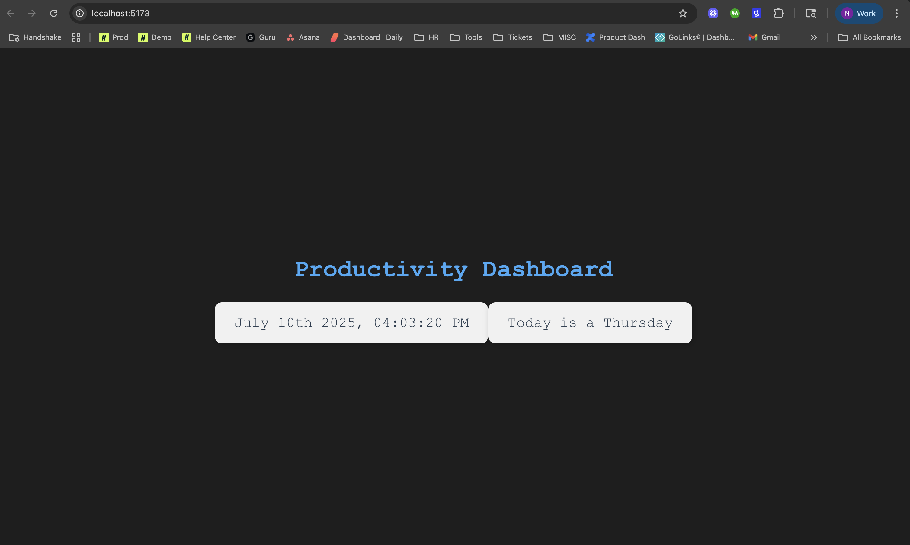

# Productivity Dashboard Clock
A colorful `React` + `Vite`-powered digital clock widget that displays the current date and time, using `date-fns` for formatting.

## Demo



## Features
- Dynamically updates every second
- Uses `date-fns` for clean, readable formatting
- Styled with custom CSS for readability and visual appeal
- Easy to expand as a reusable dashboard widget

## Getting Started
These instructions will get you a copy of the project up and running on your local machine for development or testing.

Prerequisites
- [Node.js](https://nodejs.org/) (v16+ recommended)
- [npm](https://www.npmjs.com/)

## Installation
1. Clone the Repo
```
git clone git@github.com:nrathbone-turing/Front-End-Development-React-1.git
cd ./1_react_fundamentals/lab_building_dynamic_color_clock_with_react_and_npm/color-clock
```
2. Install dependencies
```
npm install
```
3. Start the development server
```
npm run dev
```
4. Open in browser
Vite should give you a local dev URL to open
```
http://localhost:5173/
```

## Depdendencies
- React
- Vite
- date-fns

Install them automatically with `npm install`, or manually if needed:
```
npm install react react-dom date-fns
npm install --save-dev vite
```

## License
MIT — feel free to use or remix!